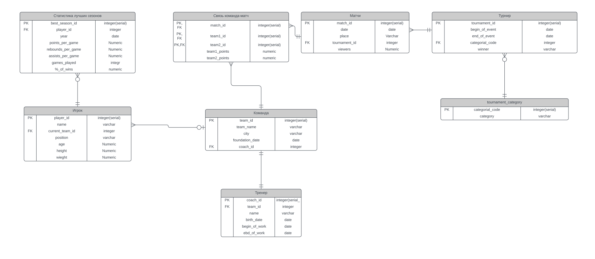

# **Проект по курсу "Базы данных"**
## **Описание проекта**
**Выбранная тема**\
База данных баскетбольной статистики\
**Мотивация**\
Эффективность в анализе статистики\
Возможность следить за показателями любимого игрока\
# **Проектирование**
Концептуальная модель\
\
Логическая модель\
\
[Физическая модель](https://github.com/gl-egor/database-of-statistics/blob/main/models/physical_model.pdf)
# Создание и заполнение БД
Выбранная СУБД - PostgreSQL\
Инструкции в языке SQL делятся на несколько типов. Прежде всего потребуется Data Definition Language: с помощью create-запросов мы создаём и описываем отношения, которые присутствуют в базе данных.\
Далее воспользуемся Data Manipulation Language. На этом шаге с помощью insert-запросов описанные выше отношения заполняются данными, чтобы в дальнейшем с ними можно было работать.
# Работа с Базой Данных
[создание запросов](https://github.com/gl-egor/database-of-statistics/blob/main/scripts/quieries.sql)
