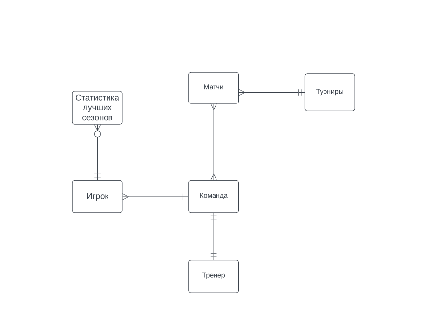

# **Проект по курсу "Базы данных"**
## **Описание проекта**
**Выбранная тема**\
База данных баскетбольной статистики\
**Мотивация**\
Эффективность в анализе статистики\
Возможность следить за показателями любимого игрока\
# **Проектирование**
Концептуальная модель\
\
Логическая модель\
\
[Физическая модель](https://github.com/gl-egor/database-of-statistics/edit/main/models/physical_model.pdf)
